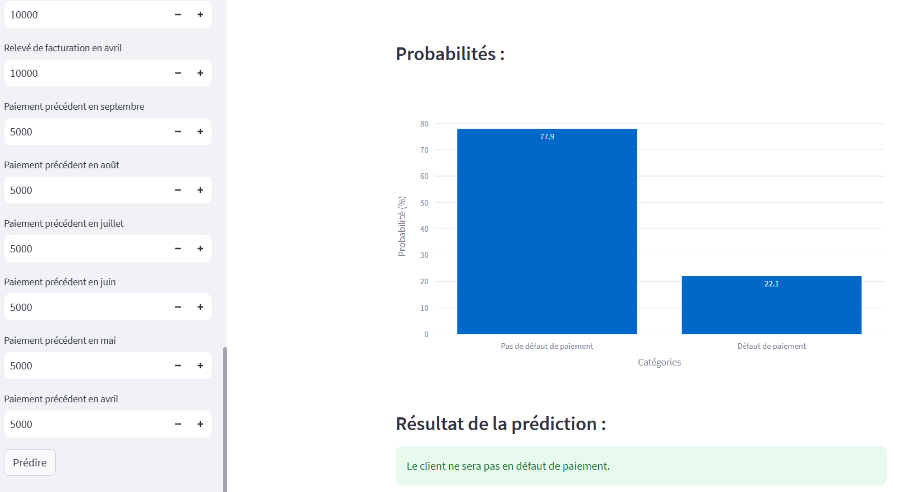

```markdown

   ## Application de prédiction de Défaut de paiement
   
   Ce projet consiste en une application de prédiction de défaut de paiement des clients, utilisant un modèle de machine learning pour prédire si un client sera en défaut de paiement. L'application est développée avec Streamlit.
   
   ## Aperçu
   
   L'application utilise un modèle de machine learning entraîné sur des données historiques pour prédire le risque de défaut de paiement d'un client. Elle offre une interface conviviale où l'utilisateur peut saisir les caractéristiques d'un client, telles que le montant du crédit, le sexe, le niveau d'éducation, l'âge, etc., pour obtenir une prédiction instantanée.
   
   ## Captures d'écran
   
   
   
   ## Installation
   
   Pour exécuter l'application localement, suivez ces étapes :
   
   1. **Clonez ce dépôt sur votre machine locale :**
      ```bash
      git clone https://github.com/gaetanyossa/Detection_fraude_bancaire.git
      ```
   
   2. **Assurez-vous d'avoir Python installé sur votre système.**
   
   3. **Installez les dépendances :**
      ```bash
      pip install -r requirements.txt
      ```
   
   4. **Exécutez l'application :**
      ```bash
      streamlit run app.py
      ```
   
   ## Structure du projet
   
   - **app.py**: Contient le code source de l'application Streamlit.
   - **credit_card_default.ipnyb**: Notebook Jupyter contenant l'analyse exploratoire des données, la création du modèle, l'évaluation et l'enregistrement du meilleur modèle.
   - **credit_card_default_utils.py**: Module Python contenant les fonctions utilitaires pour la manipulation des données et l'évaluation du modèle.
   - **best_model.pkl**: Fichier contenant le modèle de machine learning entraîné, prêt à être utilisé pour les prédictions.
   
   ## Analyse exploratoire des données
   
   Le notebook Jupyter `credit_card_default.ipnyb` comprend une analyse détaillée des données, y compris les visualisations des distributions, des corrélations, des analyses bivariées, et l'utilisation de Sweetviz pour une analyse complète des données.
   
   ## Modélisation
   
   Le processus de modélisation commence par la division des données en ensembles d'entraînement, de validation et de test. Ensuite, un pipeline de modélisation est créé, qui pré-traite les données et entraîne un modèle de forêt aléatoire. Une recherche par grille (Grid Search) est utilisée pour optimiser les hyperparamètres du modèle.
   
   ## Docker
   
   Le projet est également dockerisé pour faciliter le déploiement et l'exécution de l'application dans n'importe quel environnement Docker compatible. Vous pouvez exécuter l'application avec les commandes suivantes :
   
   1. **Construire l'image Docker :**
      ```bash
      docker build -t default_payment:v1 .
      ```
   
   2. **Exécuter l'application dans un conteneur Docker :**
      ```bash
      docker run -p 8501:8501 default_payment:v1
      ```
   
   ## Références
   
   - Dataset: [Default of Credit Card Clients Dataset](https://www.kaggle.com/uciml/default-of-credit-card-clients-dataset)
   - Streamlit: [Documentation](https://docs.streamlit.io/)
   - Scikit-learn: [Documentation](https://scikit-learn.org/stable/documentation.html)

